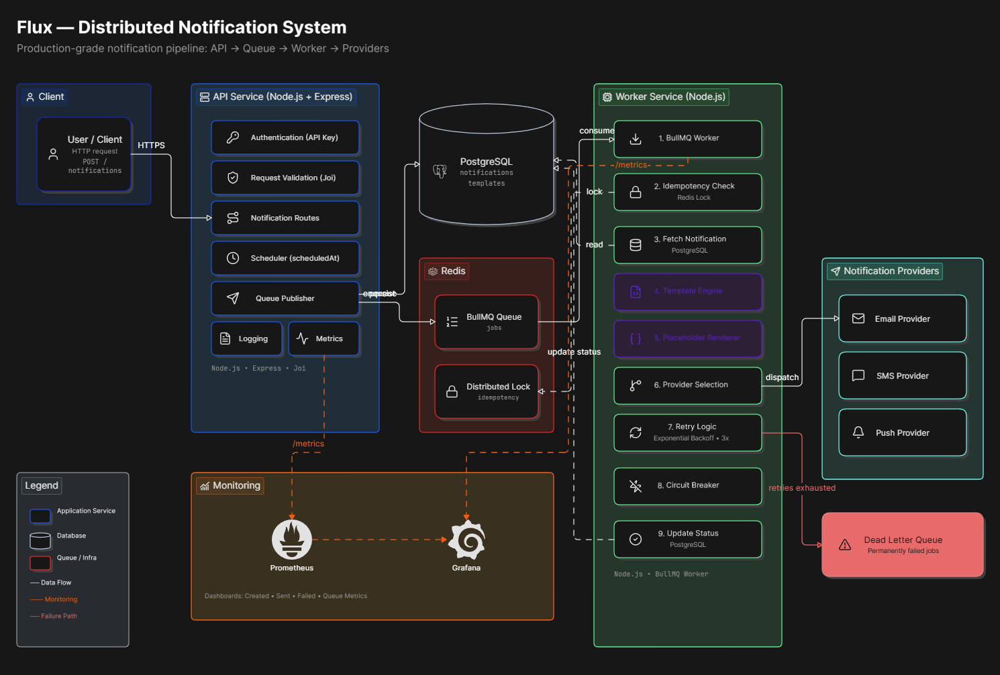
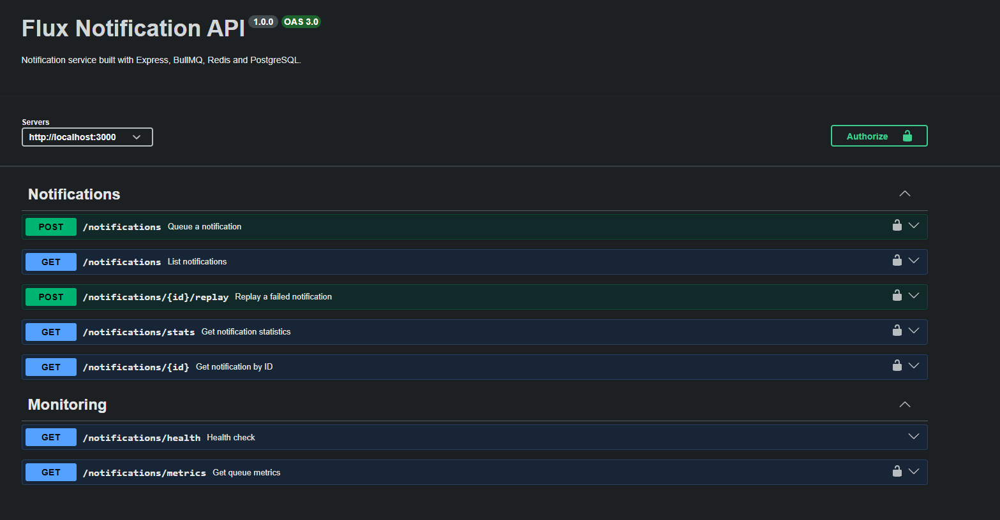
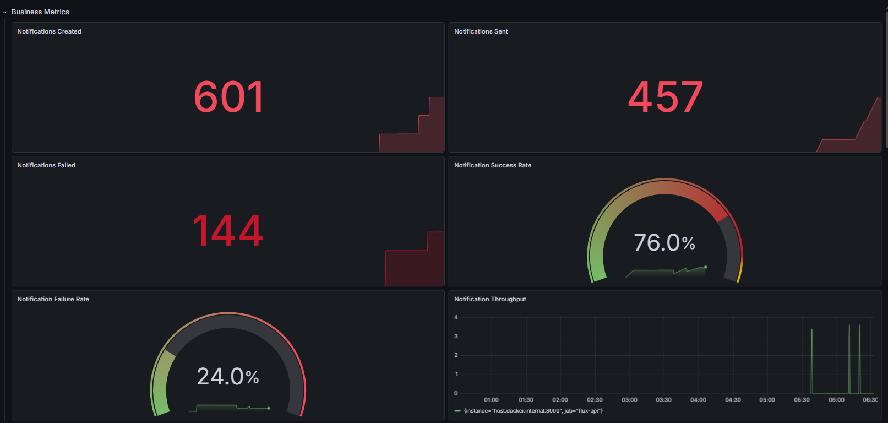
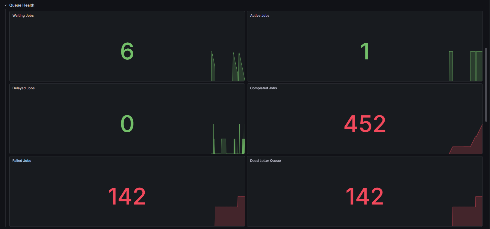
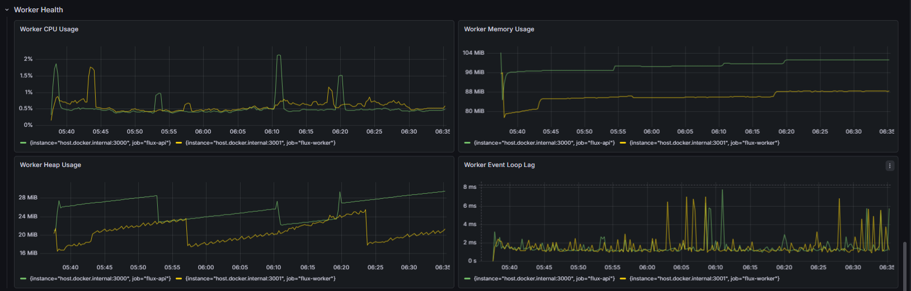
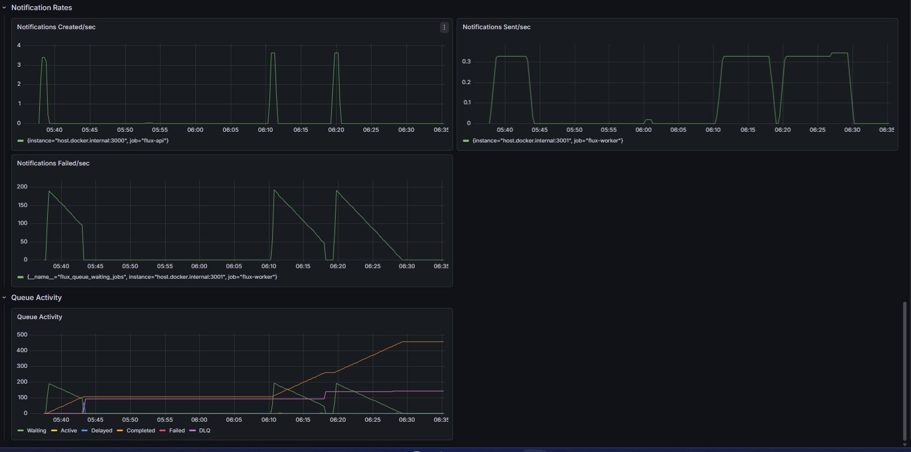

# Flux

A production-inspired distributed notification system built with Node.js, PostgreSQL, Redis, and BullMQ.

Flux provides a scalable architecture for processing asynchronous notifications with reliability features such as retries, dead-letter queues, idempotency, circuit breakers, scheduled delivery, and template-based notifications.

The project is designed to demonstrate backend engineering concepts commonly used in production systems.

---

## Features

- REST API for creating notifications
- API key authentication
- Request validation using Joi
- Asynchronous processing with BullMQ
- PostgreSQL for persistent storage
- Redis-backed job queue
- Automatic retries with exponential backoff
- Dead Letter Queue (DLQ)
- Idempotent notification processing
- Circuit breaker for provider failures
- Notification provider abstraction
- Template-based notifications
- Placeholder rendering
- Scheduled notifications
- Replay failed notifications
- Prometheus metrics
- Grafana dashboards
- Dockerized deployment using Docker Compose
---
## System Architecture
The diagram below illustrates the end-to-end architecture of Flux, including request processing, persistent storage, asynchronous job execution, reliability mechanisms, and monitoring components.



---

## Request Flow

1. Client sends a notification request to the API.
2. The API authenticates the request and validates the payload.
3. Notification metadata is stored in PostgreSQL.
4. A BullMQ job is created in Redis.
5. The worker consumes the job.
6. The worker fetches the appropriate template.
7. Template placeholders are rendered using request data.
8. The notification is sent through the selected provider.
9. On success, the notification status becomes `SENT`.
10. Failed jobs are retried with exponential backoff.
11. After all retries are exhausted, the job is moved to the Dead Letter Queue.
12. Prometheus collects metrics, and Grafana visualizes them.
---

## Tech Stack

| Category | Technology |
|----------|------------|
| Language | Node.js |
| Framework | Express.js |
| Database | PostgreSQL |
| Queue | BullMQ |
| Cache / Broker | Redis |
| Monitoring | Prometheus |
| Dashboard | Grafana |
| Containerization | Docker & Docker Compose |
| Validation | Joi |
| Logging | Winston |

---

## Project Structure

```
flux/
├── api-service/
│   ├── src/
│   │   ├── db/
│   │   ├── middleware/
│   │   ├── providers/
│   │   ├── queue/
│   │   ├── routes/
│   │   ├── templates/
│   │   ├── utils/
│   │   ├── app.js
│   │   └── server.js
│   ├── Dockerfile
│   └── package.json
│
├── worker-service/
│   ├── src/
│   │   ├── providers/
│   │   ├── templates/
│   │   ├── utils/
│   │   └── worker.js
│   ├── Dockerfile
│   └── package.json
│
├── docker-compose.yml
├── prometheus.yml
└── README.md
```

---

## Running with Docker

Clone the repository.

```bash
git clone https://github.com/Ujwalmishra1210/flux.git
cd flux
```

Build and start all services.

```bash
docker compose up --build
```

The following services will start automatically.

| Service | Port |
|---------|------|
| API | 3000 |
| Worker Metrics | 3001 |
| PostgreSQL | 5432 |
| Redis | 6379 |
| Prometheus | 9090 |
| Grafana | 3002 |

---

## Running Locally

### Start PostgreSQL

```bash
docker start flux-postgres
```

### Start Redis

```bash
docker start flux-redis
```

### API Service

```bash
cd api-service
npm install
npm start
```

### Worker Service

```bash
cd worker-service
npm install
npm start
```
---

# API Examples

## Create Notification

**POST** `/notifications`

### Headers

```http
x-api-key: YOUR_API_KEY
Content-Type: application/json
```

### Request

```json
{
  "eventType": "ORDER_PLACED",
  "recipient": "user@example.com",
  "channel": "EMAIL",
  "data": {
    "name": "Ujwal",
    "orderId": "ORD-1001"
  }
}
```

### Scheduled Notification

```json
{
  "eventType": "ORDER_PLACED",
  "recipient": "user@example.com",
  "channel": "EMAIL",
  "scheduledAt": "2026-12-31T18:30:00Z",
  "data": {
    "name": "Ujwal",
    "orderId": "ORD-2001"
  }
}
```

### Response

```json
{
  "id": "...",
  "correlationId": "...",
  "message": "Notification created"
}
```

---

## Replay Failed Notification

**POST**

```
/notifications/:id/replay
```

---

## Health Check

**GET**

```
/health
```

---

# Monitoring

## Prometheus

```
http://localhost:9090
```

Metrics exposed include:

- Notifications created
- Notifications sent
- Notifications failed

---

## Grafana

```
http://localhost:3002
```

Default credentials:

```
Username: admin
Password: admin
```


---

## Dashboard Screenshots

### API Documentation

Swagger UI provides interactive API documentation for Flux notification endpoints.




### Business Metrics Dashboard

Displays overall notification statistics including created notifications, sent notifications, failed notifications, and success rate.




### Queue Health Dashboard

Shows BullMQ queue status including waiting jobs, active jobs, completed jobs, failed jobs, and delayed jobs.




### Worker Health Dashboard

Shows worker service health and dependency monitoring.




### Notification Rates and Queue Activity

Displays notification processing rates and queue activity trends over time.



---
# Reliability Features

Flux implements several production-inspired reliability patterns:

- Retry with exponential backoff
- Dead Letter Queue (DLQ)
- Idempotent job processing
- Redis locking
- Circuit breaker
- Scheduled notifications
- Template rendering
- Provider abstraction
- Metrics and monitoring

---


